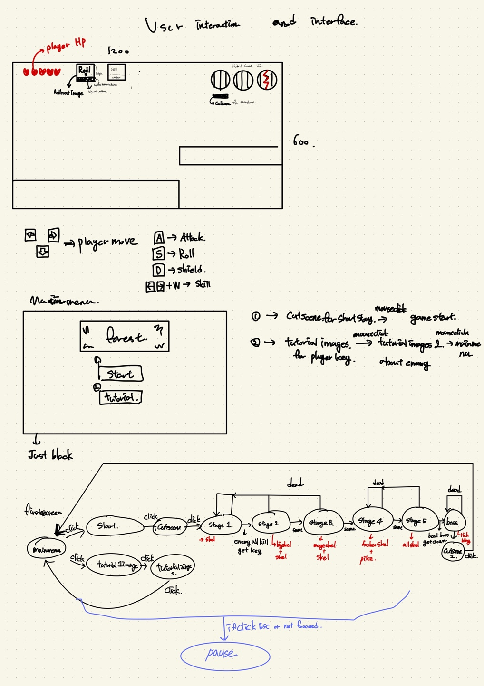
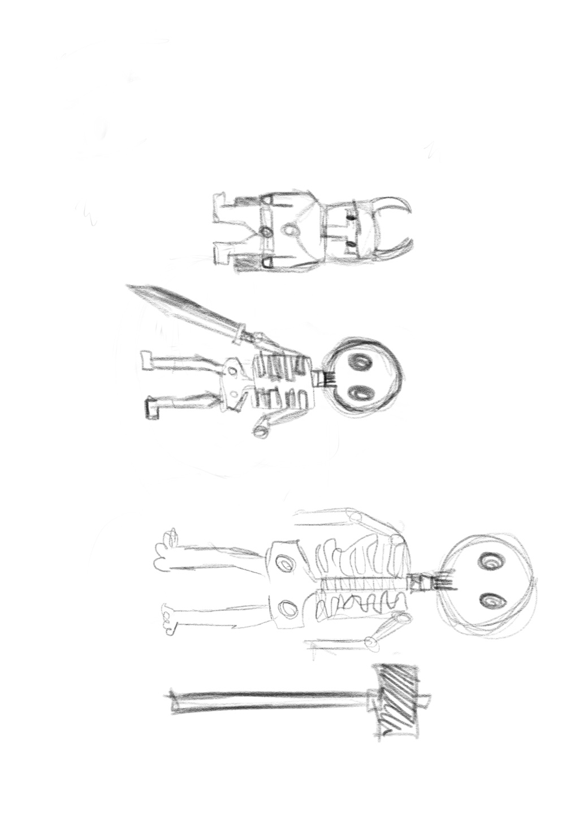
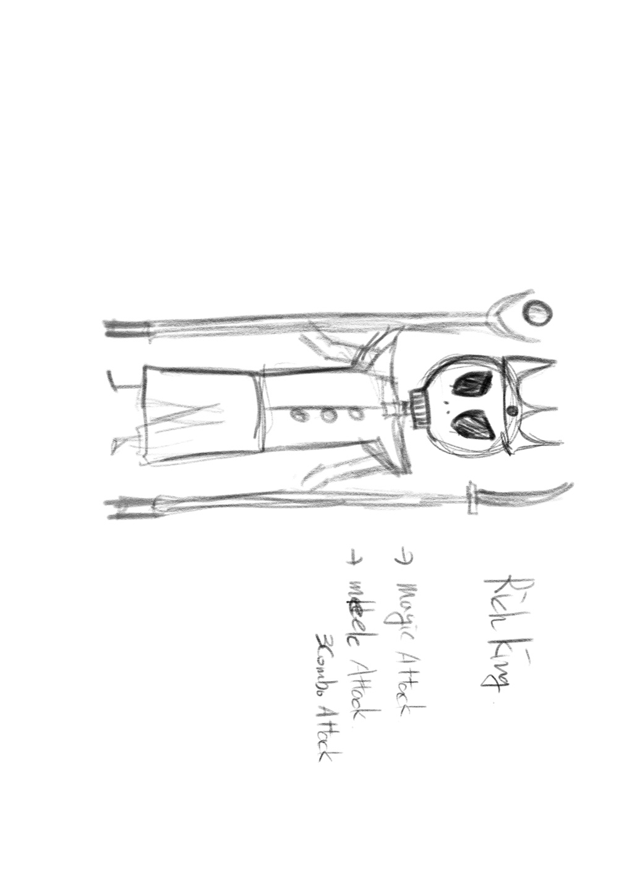

## High Concept.
* * *
I wanted to make an action game.
Top-down views or 2.5d would not be appropriate, so I decided to use the 2D platform.
I thought of a fight that requires control, not just an easy fight. Depending on the attack, some attacks could be avoided by the player rolling, but others could not be avoided by the player rolling or blocked by a shield.
* * *
## Theme : Take One, Leave The Rest
* * *
My Theme is "Dungeon"

My theme is dungeon. My main content is to enter the dungeon and fight, retrieve the crown. The warrior enters a deep forest dungeon and the game is over only when he clears it.

Of course, In other ways if you enter a dungeon, you'll have to sneak in and get treasure, but this game has to be fight. game that i thought is action game, the fight that I had to roll, avoid, stop, and hit at the right time was a fantasy fight. so I decided dungeon to Theme

* * *
## Mocks Up
***
</img> 

</img> 
A small skeleton is just one attack motion and can be parrying.
A large skeleton wields a hammer and hits the ground, sending shock waves.

</img> 
Meiji can only use magic and Archer can only shoot arrows.

</img> 
Rich King has a three-stroke attack motion and uses magic. When the player comes near while using magic, Rich King cancels and attacks.

There is no sketch except for the character. I just thought about it.
I didn't have to do the rest of the sketch, so I just did it.
***